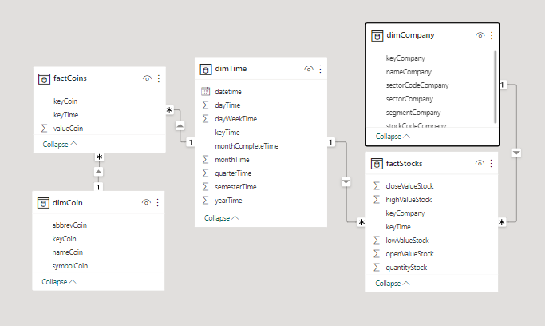

<h2>Brief intro:</h2>

Brazil stock market dataset. 
  The project utilized a standard ETL process, employed Power BI for analysis, and produced dashboards revealing insights into stock performance, market trends, and stock correlations, ultimately aiming to aid investors and financial analysts in informed decision-making.

<h2>Star Schema:</h2>

<h2>Power BI dashboard:</h2>

  
<h2>💻 Built with</h2>

Tools used in the project:

*   Power BI
